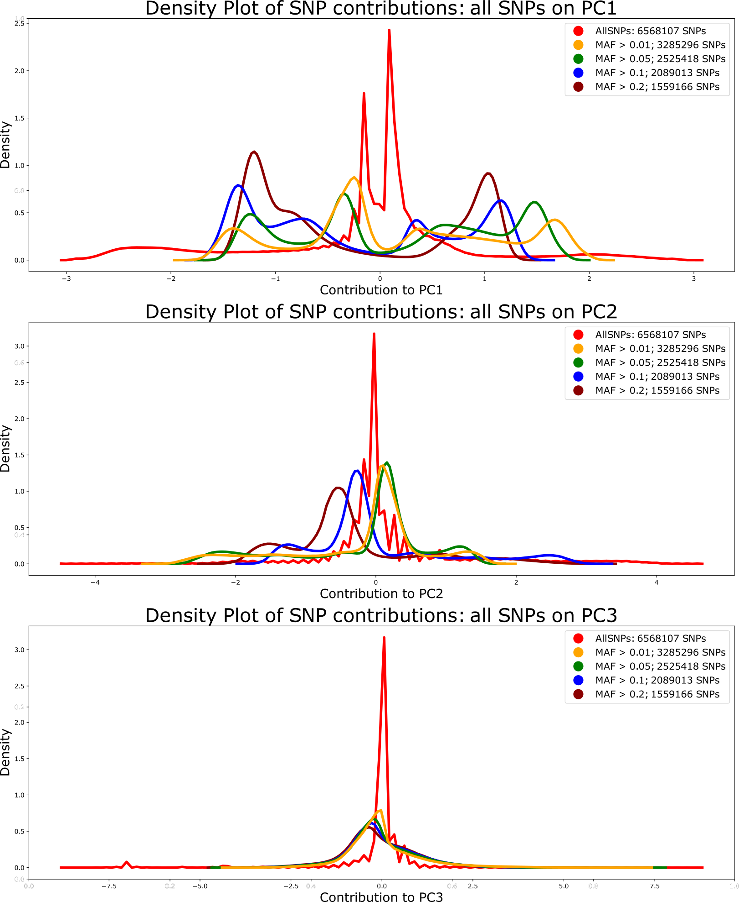

# SeqApiPop analyses: filtering on LD and PCA

The corresponding html document and scripts are also found in [Github](https://github.com/avignal5/SeqApiPop)

<!-- TOC depthFrom:2 depthTo:6 withLinks:1 updateOnSave:1 orderedList:0 -->

- [1. Defining haplotype blocks](#1-defining-haplotype-blocks)
	- [1.1 Obtaining 5 first columns for further Analysis](#11-obtaining-5-first-columns-for-further-analysis)
- [2. Preleminary filters on missing genotype data for SNPs and for samples:](#2-preleminary-filters-on-missing-genotype-data-for-snps-and-for-samples)
- [3. Filters on linkage desiquilibrium (LD), using different LD values and windows in plink and PCA](#3-filters-on-linkage-desiquilibrium-ld-using-different-ld-values-and-windows-in-plink-and-pca)
	- [3.1. PCA on complete dataset](#31-pca-on-complete-dataset)
	- [3.2. PCAs after LD filters : Use a window of the size of the largest chromosome ~ 1,000,000 SNPs](#32-pcas-after-ld-filters-use-a-window-of-the-size-of-the-largest-chromosome-1000000-snps)
		- [3.2.1. LD = 0.9](#321-ld-09)
		- [3.2.2. LD = 0.5](#322-ld-05)
		- [3.2.3. LD = 0.3](#323-ld-03)
		- [3.2.4. LD = 0.2](#324-ld-02)
		- [3.2.5. LD = 0.15](#325-ld-015)
		- [3.2.6. LD = 0.1](#326-ld-01)
		- [3.2.7. LD = 0.05](#327-ld-005)
	- [3.3. The same LD values were also run with smaller size windows](#33-the-same-ld-values-were-also-run-with-smaller-size-windows)
		- [3.3.1. For instance 1 Mb window and LD = 0.05:](#331-for-instance-1-mb-window-and-ld-005)
	- [3.4. Figure showing the number of SNPs selected for different combinations of LD thresholds and window sizes.](#34-figure-showing-the-number-of-snps-selected-for-different-combinations-of-ld-thresholds-and-window-sizes)
		- [3.4.1 Make a table fot the plot](#341-make-a-table-fot-the-plot)
		- [Plot data](#plot-data)
	- [3.5. Figures showing the influence of LD thresholds and window sizes on the selection of SNPs in haplotype blocks](#35-figures-showing-the-influence-of-ld-thresholds-and-window-sizes-on-the-selection-of-snps-in-haplotype-blocks)
- [4. Plot the PCAs](#4-plot-the-pcas)
	- [4.1. Copy with standard names](#41-copy-with-standard-names)
	- [For the moment, the best compromise seems to be LD = 0.02 ; window = whole chromosome.](#for-the-moment-the-best-compromise-seems-to-be-ld-002-window-whole-chromosome)
- [5. Same analysis, removing the NCA, MOSAR and redundant bees from the same hive](#5-same-analysis-removing-the-nca-mosar-and-redundant-bees-from-the-same-hive)
	- [5.1 Example script](#51-example-script)
	- [5.2 results](#52-results)

<!-- /TOC -->


sbatch --wrap="smartpca -p SeqApiPop_628_MillionSNPs_LD03.par"


## 1. Select the 629 samples for the plinkAnalyses

* The vcf file contains a total of 870 samples
  - All samples are of the genetic types found in western Europe and therefore were included for SNP detection based on technical metrics.
  - A list of 629 samples will be selected, by removing:
    - Duplicate samples from a same hive
	- Samples from experimental subpopulations
	- Samples from another study
	- The 15 samples with > 0.1 missing data

* 3 set of files formatted for plink will be produced, with prefixes:
  - SeqApiPop_629
    - All SNPs for the 629 samples
  - SeqApiPop_629_maf001
    - Only marlers with MAF > 0.01
  - SeqApiPop_629_maf005
    - Only marlers with MAF > 0.05


```{bash}
#! /bin/bash

#select629.bash

module load -f /work/project/cytogen/Alain/seqapipopOnHAV3_AV/program_module

NAME=SeqApiPop_629

VCFin=~/seqapipopOnHAV3_1/seqApiPopVcfFilteredSonia/plinkAnalyses/MetaGenotypesCalled870_raw_snps_allfilter_plink.vcf
VCFout=~/seqapipopOnHAV3_1/seqApiPopVcfFilteredSonia/plinkAnalyses/WindowSNPs/${NAME}
plink --vcf ${VCFin} \
  --keep-allele-order \
  --keep /work/project/cytogen/Alain/seqapipopOnHAV3_1/seqApiPopVcfFilteredSonia/plinkAnalyses/WindowSNPs/Unique629.list \
  --a2-allele ${VCFin} 4 3 '#' \
  --allow-no-sex \
  --allow-extra-chr \
  --chr-set 16 \
  --set-missing-var-ids @:#[HAV3.1]\$1\$2 \
  --chr 1-16 \
  --mind 0.1 \
  --geno 0.1 \
  --out ${VCFout} \
  --make-bed \
  --missing

plink --bfile ${VCFout} \
  --maf 0.01 \
  --out ${VCFout}_maf001 \
  --make-bed

plink --bfile ${VCFout} \
  --out ${VCFout}_maf005 \
  --maf 0.05 \
  --make-bed
```

* 7012891 variants and 629 samples pass filters and QC
* This number is slightly different than when using all 870 samples, due to variations in the number of variants removed due to missing genotypind data.

## 2. PCA with smartpca
* script paramFile.bash to generate smartpca parameter files:
* PREFIX = prefix of the plink bed file to read

```{bash}
#!/bin/bash
PREFIX=SeqApiPop_629
#PREFIX=SeqApiPop_629_maf005
#PREFIX=SeqApiPop_629_maf001
#PREFIX=SeqApiPop_629_maf001_LD03_pruned
echo genotypename: ../${PREFIX}.bed > ${PREFIX}.par
echo snpname: ../${PREFIX}.bim >> ${PREFIX}.par
echo indivname: ${PREFIX}.PCA.fam >> ${PREFIX}.par
echo snpweightoutname: ${PREFIX}.snpeigs >> ${PREFIX}.par
echo evecoutname: ${PREFIX}.eigs >> ${PREFIX}.par
echo evaloutname: ${PREFIX}.eval >> ${PREFIX}.par
echo phylipoutname: ${PREFIX}.fst >> ${PREFIX}.par
echo numoutevec: 20 >> ${PREFIX}.par
echo numoutlieriter: 0 >> ${PREFIX}.par
echo altnormstyle: NO >> ${PREFIX}.par
echo missingmode: NO >> ${PREFIX}.par
echo nsnpldregress: 0 >> ${PREFIX}.par
echo noxdata: YES >> ${PREFIX}.par
echo nomalexhet: YES >> ${PREFIX}.par
```

* The fam file needs a specific format with an additional status column:

```{bash}
awk '{print $1,$2,$3,$4,$5,1}' ../SeqApiPop_629.fam > SeqApiPop_629.PCA.fam
```

* Then run smartpca:

```{bash}
sbatch --wrap="smartpca -p SeqApiPop_629.par"
```

<div style="page-break-after: always"></div>

## 2.1 plot of PC1 and PC2 using all markers

* From the log of smartpca, with SeqApiPop_629.* only:
  - number of samples used: 629 number of snps used: 7012891
  - total number of snps killed in pass: 444784  used: 6568107
* As soon as there is the slightest amount of selection on MAF, all remaining SNPs are used.
  - This could be an effect of SNPs only present in the individuals that were removed from the original 870 sample dataset.
* Plot of PC1 and PC2 with all markers and samples from reference populations (file SeqApiPop_629.eigs):


**Principal component analysis for all SNPs: reference populations.**
The first component separates clearly the A. m. mellifera and A. m. iberica on one side and the A. m. ligustica, A. m. carnica and A. m. caucasica on the other. The second distinguishes the A. m. caucasica from the rest.

-----------------------

<div style="page-break-after: always"></div>

## 2.2 plot of SNP contributions to the PCs, according to MAF thresholds

* The output files \*.SeqApiPop_629.snpeigs are used to plot the SNP contributions to the principal components.
  - SeqApiPop_629.snpeigs
  - SeqApiPop_629_maf001.snpeigs
  - SeqApiPop_629_maf005.snpeigs
  - SeqApiPop_629_maf01.snpeigs
  - SeqApiPop_629_maf02.snpeigs


**Contributions of SNPs to PCs 1, 2 and 3, according to MAF filters.**

With no MAF filtering (red lines), there is a high proportion of SNPs contributing very little to PC1 and most SNPs do not contribute to PC2 and PC3. With MAF filtering, the proportion of SNPs contributing to the PCs increases, including for PCs 2 and 3.

-----------------------

<div style="page-break-after: always"></div>


#OLD TEXT

## 1. Defining haplotype blocks

```bash
#! /bin/bash

#haplotypeBlocks5000.sh

module load -f /work/project/cytogen/Alain/seqapipopOnHAV3_AV/program_module

NAME=haplotypeBlocks5000

plink --bfile ../MetaGenotypesCalled870_raw_snps_allfilter_plink_missIndGeno \
  --out ${NAME} \
  --blocks no-pheno-req no-small-max-span \
  --blocks-max-kb 5000
```

### 1.1 Obtaining 5 first columns for further Analysis
```bash
 awk '{print $1,$2,$3,$4,$5}' haplotypeBlocks5000.blocks.det > haplotypeBlocks5000.blocks.cols
```

## 2. Preleminary filters on missing genotype data for SNPs and for samples:

* --maf filters out all variants with minor allele frequency below the provided threshold (default 0.01)
* --geno filters out all variants with missing call rates exceeding the provided value (default 0.1) to be removed
* --mind does the same for samples.
* --indep-pairwise 500000 50000 0.9 : LD filters out variants with LD > 0.9, on a window of 500000 SNPs, a sliding window of 50000.


File with the 7023689  variants:
/work/project/cytogen/Alain/seqapipopOnHAV3_1/seqApiPopVcfFilteredSonia/plinkAnalyses/MetaGenotypesCalled870_raw_snps_allfilter_plink


More stringent on missing data in individuals:

```bash
#! /bin/bash

#convertToBed.bash

module load -f /work/project/cytogen/Alain/seqapipopOnHAV3_AV/program_module

VCFin=/work/project/cytogen/Alain/seqapipopOnHAV3_1/seqApiPopVcfFilteredSonia/plinkAnalyses/MetaGenotypesCalled870_raw_snps_allfilter_plink.vcf
VCFout=/work/project/cytogen/Alain/seqapipopOnHAV3_1/seqApiPopVcfFilteredSonia/plinkAnalyses/MetaGenotypesCalled870_raw_snps_allfilter_plink_missIndGeno
plink --vcf ${VCFin} \
  --keep-allele-order \
  --a2-allele ${VCFin} 4 3 '#' \
  --allow-no-sex \
  --allow-extra-chr \
  --chr-set 16 \
  --set-missing-var-ids @:#[HAV3.1]\$1\$2 \
  --chr 1-16 \
  --mind 0.1 \
  --geno 0.1 \
  --out ${VCFout} \
  --make-bed \
  --missing
```

* 11075 variants removed due to missing genotype data (--geno)
* 15 samples removed due to missing genotype data (--mind).

**Samples removed: frequency of missing genotypes from the \*.imiss plink file:**

|ID | N_MISS | N_GENO | F_MISS|
|:---|---:|---:|---:|
|AOC4 | 1270404 | 7023689 | 0.1809|
|BR12 | 1269182 | 7023689 | 0.1807|
|BR1A | 1253619 | 7023689 | 0.1785|
|ESP9 | 6208279 | 7023689 | 0.8839|
|JFM21 | 725846 | 7023689 | 0.1033|
|JFM24 | 817509 | 7023689 | 0.1164|
|JFM3 | 875208 | 7023689 | 0.1246|
|JFM5 | 830181 | 7023689 | 0.1182|
|KF21 | 722607 | 7023689 | 0.1029|
|OUE8 | 831427 | 7023689 | 0.1184|
|PM1 | 969888 | 7023689 | 0.1381|
|SavB1 | 823422 | 7023689 | 0.1172|
|SavB3 | 706024 | 7023689 | 0.1005|
|XC3 | 821334 | 7023689 | 0.1169|
|XC4 | 747325 | 7023689 | 0.1064|


## 3. Filters on linkage desiquilibrium (LD), using different LD values and windows in plink and PCA


### 3.1. PCA on complete dataset

```bash
#! /bin/bash

#7millionSNPs.sh

module load -f /work/project/cytogen/Alain/seqapipopOnHAV3_AV/program_module

NAME=7millionSNPs

plink --bfile ../MetaGenotypesCalled870_raw_snps_allfilter_plink_missIndGeno \
  --out PCA_${NAME} \
  --pca
```

### 3.2. PCAs after LD filters : Use a window of the size of the largest chromosome ~ 1,000,000 SNPs

#### 3.2.1. LD = 0.9

```bash
#! /bin/bash

#LD09_Chromosomes.sh

module load -f /work/project/cytogen/Alain/seqapipopOnHAV3_AV/program_module

NAME=LD09_Chromosomes

plink --bfile ../MetaGenotypesCalled870_raw_snps_allfilter_plink_missIndGeno \
  --out ${NAME} \
  --indep-pairwise 1000000 100000 0.9

plink --bfile ../MetaGenotypesCalled870_raw_snps_allfilter_plink_missIndGeno \
    --out ${NAME}_pruned \
	--extract ${NAME}.prune.in \
	--make-bed

plink --bfile ${NAME}_pruned \
  --out PCA_${NAME} \
  --pca
```

#### 3.2.2. LD = 0.5

```bash
#! /bin/bash

#LD05_Chromosomes.sh

module load -f /work/project/cytogen/Alain/seqapipopOnHAV3_AV/program_module

NAME=LD05_Chromosomes

plink --bfile ../MetaGenotypesCalled870_raw_snps_allfilter_plink_missIndGeno \
  --out ${NAME} \
  --indep-pairwise 1000000 100000 0.5

plink --bfile ../MetaGenotypesCalled870_raw_snps_allfilter_plink_missIndGeno \
    --out ${NAME}_pruned \
	--extract ${NAME}.prune.in \
	--make-bed

plink --bfile ${NAME}_pruned \
  --out PCA_${NAME} \
  --pca
```

#### 3.2.3. LD = 0.3

```bash
#! /bin/bash

#LD03_Chromosomes.sh

module load -f /work/project/cytogen/Alain/seqapipopOnHAV3_AV/program_module

NAME=LD03_Chromosomes

plink --bfile ../MetaGenotypesCalled870_raw_snps_allfilter_plink_missIndGeno \
  --out ${NAME} \
  --indep-pairwise 1000000 100000 0.3

plink --bfile ../MetaGenotypesCalled870_raw_snps_allfilter_plink_missIndGeno \
    --out ${NAME}_pruned \
	--extract ${NAME}.prune.in \
	--make-bed

plink --bfile ${NAME}_pruned \
  --out PCA_${NAME} \
  --pca
```

#### 3.2.4. LD = 0.2

```bash
#! /bin/bash

#LD02_Chromosomes.sh

module load -f /work/project/cytogen/Alain/seqapipopOnHAV3_AV/program_module

NAME=LD02_Chromosomes

plink --bfile ../MetaGenotypesCalled870_raw_snps_allfilter_plink_missIndGeno \
  --out ${NAME} \
  --indep-pairwise 1000000 100000 0.2

plink --bfile ../MetaGenotypesCalled870_raw_snps_allfilter_plink_missIndGeno \
    --out ${NAME}_pruned \
	--extract ${NAME}.prune.in \
	--make-bed

plink --bfile ${NAME}_pruned \
  --out PCA_${NAME} \
  --pca
```

#### 3.2.5. LD = 0.15

```bash
#! /bin/bash

#LD015_Chromosomes.sh

module load -f /work/project/cytogen/Alain/seqapipopOnHAV3_AV/program_module

NAME=LD015_Chromosomes

plink --bfile ../MetaGenotypesCalled870_raw_snps_allfilter_plink_missIndGeno \
  --out ${NAME} \
  --indep-pairwise 1000000 100000 0.15

plink --bfile ../MetaGenotypesCalled870_raw_snps_allfilter_plink_missIndGeno \
    --out ${NAME}_pruned \
	--extract ${NAME}.prune.in \
	--make-bed

plink --bfile ${NAME}_pruned \
  --out PCA_${NAME} \
  --pca
```

#### 3.2.6. LD = 0.1

```bash
#! /bin/bash

#LD01_Chromosomes.sh

module load -f /work/project/cytogen/Alain/seqapipopOnHAV3_AV/program_module

NAME=LD01_Chromosomes

plink --bfile ../MetaGenotypesCalled870_raw_snps_allfilter_plink_missIndGeno \
  --out ${NAME} \
  --indep-pairwise 1000000 100000 0.1

plink --bfile ../MetaGenotypesCalled870_raw_snps_allfilter_plink_missIndGeno \
    --out ${NAME}_pruned \
	--extract ${NAME}.prune.in \
	--make-bed

plink --bfile ${NAME}_pruned \
  --out PCA_${NAME} \
  --pca
```

#### 3.2.7. LD = 0.05

```bash
#! /bin/bash

#LD005_Chromosomes.sh

module load -f /work/project/cytogen/Alain/seqapipopOnHAV3_AV/program_module

NAME=LD005_Chromosomes

plink --bfile ../MetaGenotypesCalled870_raw_snps_allfilter_plink_missIndGeno \
  --out ${NAME} \
  --indep-pairwise 1000000 100000 0.05

plink --bfile ../MetaGenotypesCalled870_raw_snps_allfilter_plink_missIndGeno \
    --out ${NAME}_pruned \
	--extract ${NAME}.prune.in \
	--make-bed

plink --bfile ${NAME}_pruned \
  --out PCA_${NAME} \
  --pca
```

### 3.3. The same LD values were also run with smaller size windows
* 1 Mb
* 500 kb
* 100 kb
* 50 kb
* 10 kb

#### 3.3.1. For instance 1 Mb window and LD = 0.05:

```bash
#! /bin/bash

#LD005_Chromosomes.sh

module load -f /work/project/cytogen/Alain/seqapipopOnHAV3_AV/program_module

NAME=LD005_Chromosomes

plink --bfile ../MetaGenotypesCalled870_raw_snps_allfilter_plink_missIndGeno \
  --out ${NAME} \
  --indep-pairwise 1000 kb 100 0.05

plink --bfile ../MetaGenotypesCalled870_raw_snps_allfilter_plink_missIndGeno \
    --out ${NAME}_pruned \
        --extract ${NAME}.prune.in \
        --make-bed

plink --bfile ${NAME}_pruned \
  --out PCA_${NAME} \
  --pca
```

### 3.4. Figure showing the number of SNPs selected for different combinations of LD thresholds and window sizes.
#### 3.4.1 Make a table fot the plot

* Table : LD threshold, window size, SNPs retained
* Done by extracting the data from the logfiles of the plink --pca runs

```bash
#!/bin/bash
grep 'variants loaded' PCAsWind*/PCA*log | sed s'/variants loaded from .bim file.//' | sed 's/:/\t/' | sed 's/_/\t/g' | sed 's/\//\t/' | sed 's/PCAsWindow//' | grep -v 7millionSNPs
 | awk 'BEGIN{OFS="\t"}{print $1,$3,$5}' > SNPselectionStats2.txt
```

#### Plot data
* script PlotHaplosLDChrRegion.py


### 3.5. Figures showing the influence of LD thresholds and window sizes on the selection of SNPs in haplotype blocks
* Areas shaded in grey are the haplotype blocks > 100 as detected by plink.
* Whole genome: 
  - Figure generated with PlotHaplosLDselCompWind.py
* And a selection of 4 haplotype haploBlocks
  - Figures generated with PlotHaplosLDChrRegion.py


* SNP counts in large haplotypeblocks are lower.
* Larger window sizes for LD pruning eliminate more SNPs in large haplotype blocks

## 4. Plot the PCAs
### 4.1. Copy with standard names
* run the script below for the *.log, *.eigenvec and *.eigenval files

```bash
#!/bin/bash

#copyRename.#!/usr/bin/env bash
#Copies the outputs from plink --PCA and renames with window size and LD thresholds used

for i in `ls ../PCA*/PCA*eigenval | grep Wind | grep -v 7millionSNPs`
do
WIND=${i%/*}
WIND=${WIND#*/}
WIND=${WIND/PCAsWindow}
LD=${i%_*}
LD=${LD#*_}
NAME=PCA_${WIND}_${LD}.eigenval
cp ${i} ${NAME}
done
```
* all in /Users/avignal/Documents/Stats/2019_SeqApiPop_HAv3_1/PCAsAll
* Then run the script Plot6PCAs.py

### For the moment, the best compromise seems to be LD = 0.02 ; window = whole chromosome.


## 5. Same analysis, removing the NCA, MOSAR and redundant bees from the same hive

### 5.1 Example script

```bash
#! /bin/bash

#LD015_Chromosomes.sh

module load -f /work/project/cytogen/Alain/seqapipopOnHAV3_AV/program_module

NAME=LD015_Chromosomes

plink --bfile ../../MetaGenotypesCalled870_raw_snps_allfilter_plink_missIndGeno \
  --keep ../DataSamplesNoNcaNoMosarNoDuplicates.list \
  --out ${NAME} \
  --indep-pairwise 100 kb 10 0.15

plink --bfile ../../MetaGenotypesCalled870_raw_snps_allfilter_plink_missIndGeno \
  --out ${NAME}_pruned \
  --keep ../DataSamplesNoNcaNoMosarNoDuplicates.list \
  --extract ${NAME}.prune.in \
  --make-bed

plink --bfile ${NAME}_pruned \
  --out PCA_${NAME} \
  --pca
```

* all in /Users/avignal/Documents/Stats/2019_SeqApiPop_HAv3_1/PCAsNoNcaNoMosarNoDuplicates
* Then run the script Plot6PCAs.py for plotting reference populations from 6 different run conditions (LD values, Window sizes) to one page.
* Run script Plot6PCAsAllPops.py for plotting all populations for one condition in 6 plots to one page.

### 5.2 results

* Filtering with LD 0.3 gives a good compromise between keeping the C-type, M-type and caucasicas separate, while separating subpopulations (especially of melliferas). The number of SNPs retained varies between 800,000 (window of the size of a chromosome) and 2.5 million (10 kb window), but the pattern is stable over the different window sizes.
* Filtering with LD 0.2 (window of the size of a chromosome) further separates the mellifera groups (400,000 SNPs retained), but smaller windows tend to separate the ibericas before the caucasicas, a pattern which is not representative of the "all SNPs" pattern of 3 main sub-populations.
